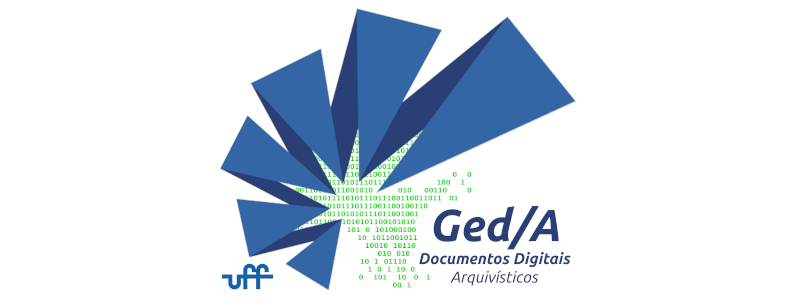

# *El* PCD
*Elaborador de Plano de Classificação de Documentos e Tabela de Temporalidade Documental*

O objetivo é que além de um software para a elaboração e gerenciamento de PCDs
e TTDs, tenhamos a possibilidade de interoperabilizar estes instrumentos
arquivísticos entre sistemas (implementando assim um padrão de dados abertos),
através da implementação do Esquema de Metadados do e-ARQ Brasil v2, aliado ao
padrão CSV ISAD(G) do AtoM (Plataforma Arquivística de Descrição, Acesso e
Transparência Ativa de Documentos e Informações -
[Access To Memory](https://www.accesstomemory.org/))

Entre em contato conosco pelo nosso email: cnpqdocsdigitais@gmail.com